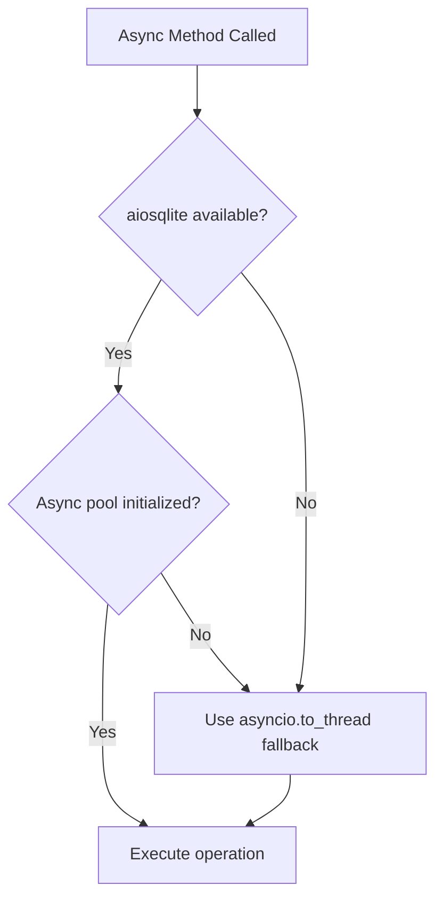

# Async Database Dispatch Precedence Contract

## Overview

This document describes the dispatch precedence contract for the async database operations in LOATS13July2026. The system implements a tri-modal persistence mechanism with clear precedence rules.

## Dispatch Precedence

The async database operations follow this precedence order:

1. **Primary (Preferred)**: True async aiosqlite pool operations
2. **Fallback**: `asyncio.to_thread` wrapper around synchronous sqlite3 operations
3. **Legacy**: Direct synchronous sqlite3 operations (thread-local connections)

## Decision Flow

## Method Mapping

### Core Async Methods (True Async)
- `_async_create_signal()`
- `_async_store_historical_data()`
- `_async_store_quote()`
- `_async_store_position()`
- `_async_store_funds()`
- `_async_get_latest_signals()`
- `_async_update_trade()`
- `_async_update_order_status()`
- `async_get_trade()`
- `_async_log_audit()`

### Wrapper Methods (Dispatch Logic)
- `async_create_signal()`
- `async_store_historical_data()`
- `async_store_quote()`
- `async_store_position()`
- `async_store_funds()`
- `async_get_latest_signals()`
- `async_update_trade()`
- `async_update_order_status()`

## Implementation Details

### True Async Path (Primary)
- Uses `aiosqlite` with connection pooling
- Connection pool: `SimpleConnectionPool` with maxsize=10
- Each operation acquires/releases connections from pool
- Proper async/await pattern throughout
- Best performance and scalability

### Fallback Path
- Uses `asyncio.to_thread()` to run synchronous operations
- Prevents blocking the event loop
- Uses existing synchronous sqlite3 implementation
- Maintains compatibility when aiosqlite unavailable

### Legacy Path
- Direct synchronous sqlite3 operations
- Thread-local connection caching
- Traditional blocking I/O
- Used when both async paths unavailable

## Error Handling

1. **Connection Pool Errors**: Retry with new connection if test fails
2. **aiosqlite Import Errors**: Graceful fallback to asyncio.to_thread
3. **Audit Log Failures**: Raise exception before DB commit to maintain consistency
4. **Pool Cleanup**: Proper shutdown with 30-second timeout for active connections

## Performance Characteristics

| Path | Latency | Throughput | Event Loop Impact | Connection Overhead |
|------|---------|------------|-------------------|---------------------|
| True Async | Lowest | Highest | None | Medium (pool management) |
| Fallback | Medium | Medium | Low (thread switching) | Low (reuses sync connections) |
| Legacy | Highest | Lowest | High (blocking) | Low (thread-local) |

## Production Recommendations

1. **Preferred Path**: True async operations (aiosqlite pool)
2. **Monitoring**: Track dispatch path usage in metrics
3. **Fallback Threshold**: Alert if >10% operations use fallback path
4. **Pool Monitoring**: Monitor pool size, wait times, and connection churn

## Testing Coverage

All dispatch paths are tested:
- True async methods with aiosqlite available
- Fallback methods when aiosqlite unavailable
- Fallback methods when pool not initialized
- Error conditions and edge cases

## Migration Path

The system is designed for gradual migration:
1. Start with fallback path (existing functionality)
2. Enable aiosqlite for new deployments
3. Monitor performance and stability
4. Phase out legacy synchronous calls over time

## Compatibility

- **Backward Compatible**: Existing synchronous code continues to work
- **Forward Compatible**: New async code works with or without aiosqlite
- **Thread Safe**: All paths handle concurrent access properly